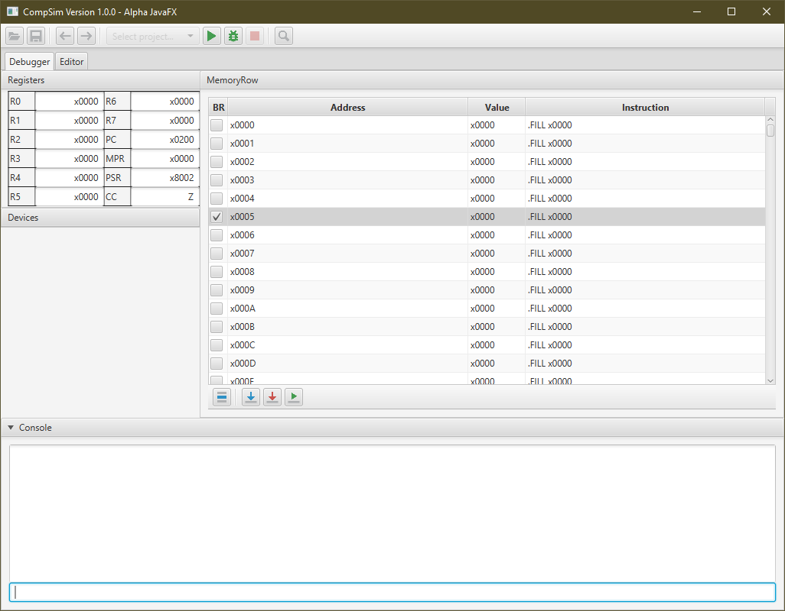

<!-- HEADER -->
<h1 align="center">
   
    
   
    CompSim
   
</h1>

<h4 align="center">A modern take on the original Little Computer 3 (LC3) Java/Swing variants using Kotlin and JavaFX.</h4>

<!-- SHIELDS -->

  
  
  
  

<!-- LINKS -->

  <a href="#features">Features</a> •
  <a href="#how-to-use">How To Use</a> •
  <a href="#contributing">Contributing</a>

<!-- SCREENSHOT -->
<h4 align="center">
   
    
   
    Screenshot of CompSim Alpha v1.0.0 running on Windows
   
</h4>

## Features

  * Original Java source rewritten i Kotlin for simplification and speed
  * GUI changed from Swing/AWT to JavaFX
  * Added new commands to simplify common tasks
  * Built in editor to streamline the process of writing and debugging source code
  * Multiple supported languages
  * Compiler support for basic C and Python
  * Multiple instruction sets (LC3, P37X, etc...)
  
  See the [Features Status page]() on the project Wiki for information about the status of the above features

## How To Use

  It is recommended that you import the project into an IDE such as IntelliJ and build it in there using the Maven setup provided.

  Once you get the project running give [A Gentle Guide to Using CompSim]() on the wiki a read to learn the basics of CompSim and the LC3 architecture.

## Contributing

  For now if you would like to contribute check out any current [projects](https://github.com/dadler64/CompSim/projects) that need work as well as any open [issues](https://github.com/dadler64/CompSim/issues) which could be resolved.
